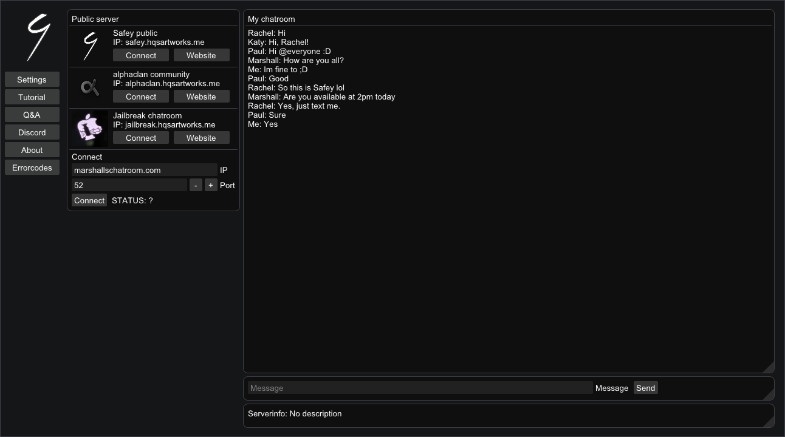
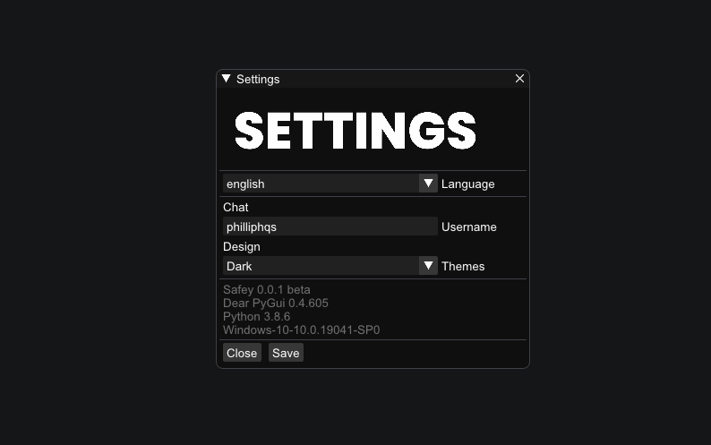

# Safey
> A chatroom application for Windows, macos and Linux


Chat with your friends in chatrooms or create your own chatroom and create your own community!



## Installation

OS X & Linux & Linux:

```sh
pip install -r requirements.txt
```
```sh
python main.py
```

## Themes

If you are bored to see everytime the same dark boring theme then view the settings and change quickly the theme for Safey.
_Themecreator coming soon_



## Release History

* 0.0.1 beta
    * _Work in progress_
    * ✔ Discord RichPresence (using pypresence)
    * ✔ Languages (English, German, Türkiye, Tigrinya, Amharic) help us to translate languages view more [here](https://github.com/philliphqs/Safey/tree/main/languages/README.md)
    * ✔ Themes
    * ❌ Themecreator
    * ❌ Chatting (because there is no ability to call [Dear PyGui] functions from other threads)
    * ❌ P2P chat (Peer to Peer)
    * ❌ Proxy function
    * ❌ Chatroom bookmarks
    * ❌ Filesharing
    * ❌ InBuild file viewer for images(.png, .jpg), audios(.mp3, .wav, .ogg), text(.txt, .docx), code(.py, .js, .html, .css, .json, .xml) 
    * ❌ Audiorecorder
    
## Meta

philliphqs – [@phillip_hqs](https://twitter.com/phillip_hqs) – contact@hqsartworks.me

Distributed under the MIT license. See ``LICENSE`` for more information.

[https://github.com/philliphqs/](https://github.com/philliphqs/)

## Contributing

1. Fork it (<https://github.com/philliphqs/Safey/fork>)
2. Create your feature branch (`git checkout -b feature/fooBar`)
3. Commit your changes (`git commit -am 'Add some fooBar'`)
4. Push to the branch (`git push origin feature/fooBar`)
5. Create a new Pull Request

<!-- Markdown link & img dfn's -->
[wiki]: https://github.com/philliphqs/Safey/wiki
[Dear PyGui]: https://github.com/hoffstadt/dearpygui
